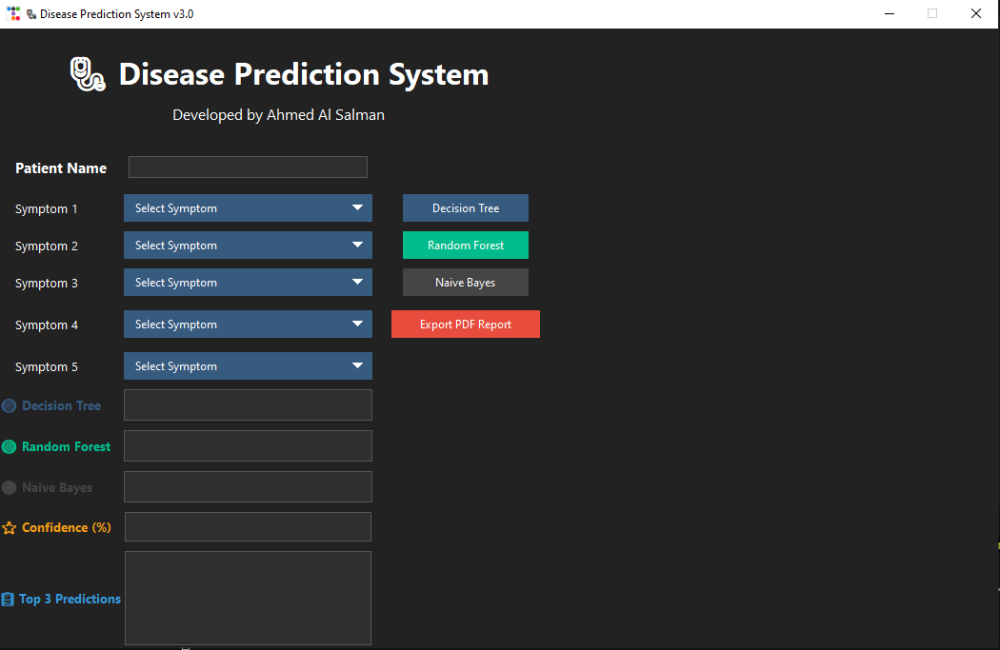
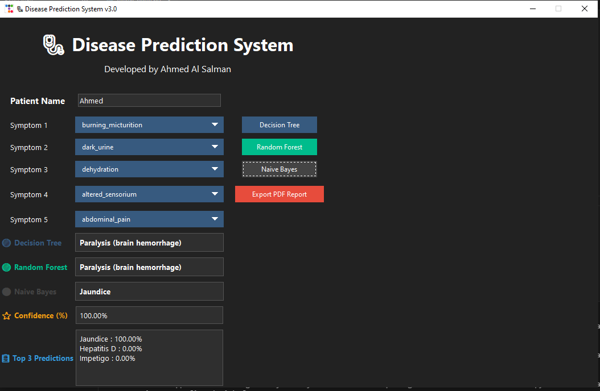
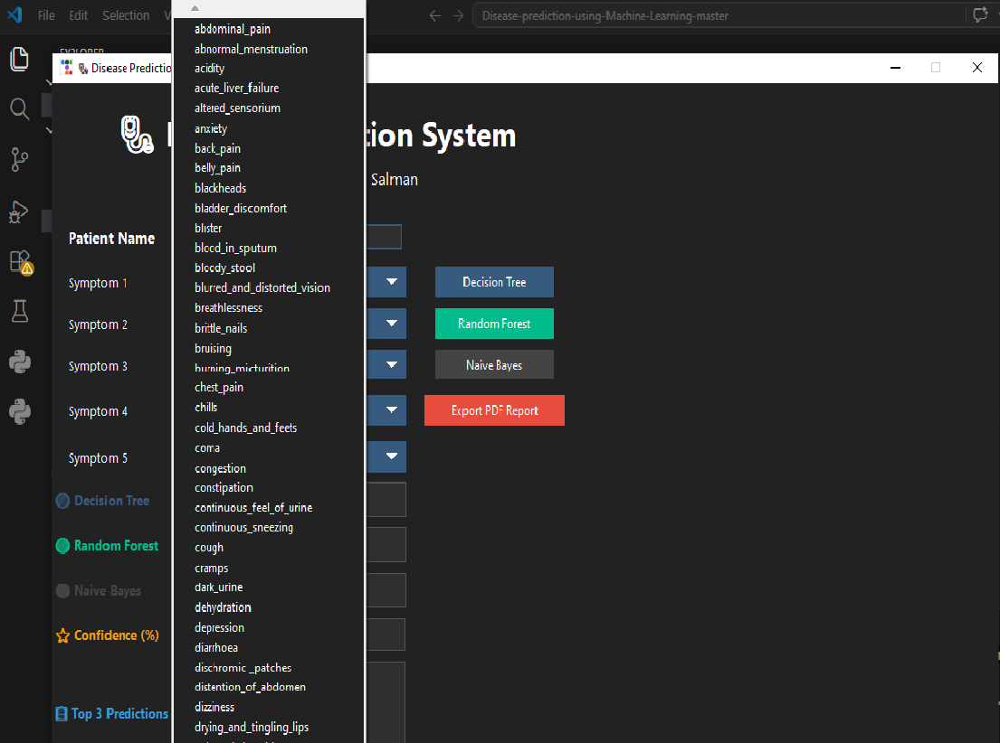
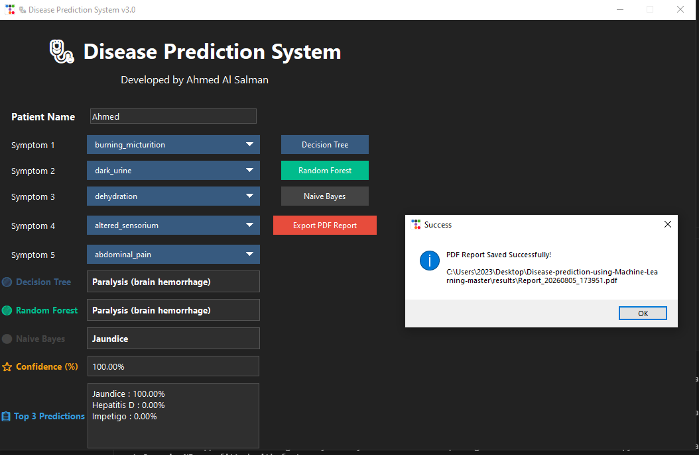

# 🩺 AI-Powered Disease Prediction System

An intelligent Disease Prediction System developed using Python and Machine Learning. The application predicts possible diseases based on selected symptoms through an interactive graphical user interface (GUI).

---

## 📌 Overview

This project applies Machine Learning algorithms to assist in disease prediction based on user-selected symptoms. It demonstrates how Artificial Intelligence can support healthcare by providing quick and accurate predictions.

---

## ✨ Features

- Interactive Python GUI
- Predict diseases from selected symptoms
- Supports multiple Machine Learning models
- Easy-to-use interface
- Fast prediction results
- Organized project structure
- Open-source project

---

## 🤖 Machine Learning Models

- Decision Tree
- Random Forest
- Naive Bayes

---

## 🛠️ Technologies Used

- Python
- Tkinter
- Scikit-learn
- Pandas
- NumPy
- Joblib

---

## 📁 Project Structure

Disease-Prediction-System
│
├── app
│   ├── assets
│   ├── clean_code.py
│   ├── data_loader.py
│   ├── models.py
│   └── train_models.py
│
├── data
├── models
├── screenshots
├── README.md
├── LICENSE
├── requirements.txt
└── .gitignore

---

## 🚀 Installation

Clone the repository

bash
git clone https://github.com/YOUR_USERNAME/Disease-Prediction-System.git

Install dependencies

bash
pip install -r requirements.txt

Run the application

bash
python app/clean_code.py

---

## 📷 Screenshots

## 📷 Screenshots

### 🏠 Home

### 🔍 Prediction

### 🩺 Symptoms

### 📄 Report

---

## 🔮 Future Improvements

- Deep Learning models
- Medical API integration
- Cloud deployment
- User authentication
- Mobile application
- Performance optimization

---

## 📄 License

This project is licensed under the MIT License.

---

## 👨‍💻 Author

Ahmed Al Salman

Cybersecurity & Artificial Intelligence Engineer

GitHub:
https://github.com/Ahmed-Adnan-AlSalman
